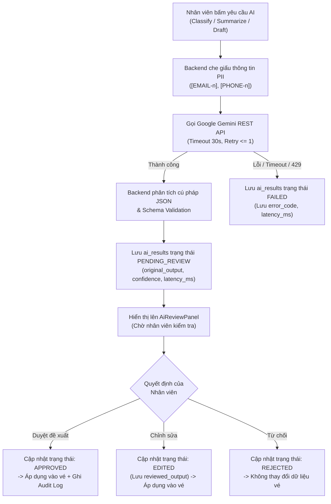
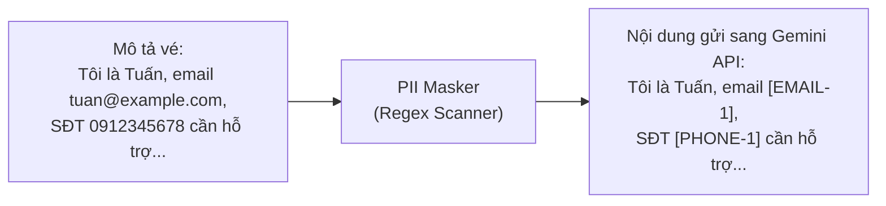

# TÀI LIỆU QUẢN LÝ NHẬT KÝ & VÒNG ĐỜI TRỢ LÝ AI (AI LOGGING & HUMAN-IN-THE-LOOP)

> **Hệ thống hỗ trợ khách hàng có tích hợp AI (Customer Support System with AI Assistant)**  
> Trợ lý AI: **Google Gemini API (gemini-3.8-flash) & MockProvider**  
> Nguồn căn cứ: [`documents/SRS.md`](../documents/SRS.md) — Mục 4.6-4.8, 6.3.7 & [`backend/app/ai/`](../backend/app/ai/)

---

## 1. Nguyên tắc cốt lõi: Human-in-the-loop

Trong hệ thống, Trí tuệ nhân tạo (AI) đóng vai trò là **Trợ lý hỗ trợ nhân viên (Assistant)** chứ **không bao giờ là người ra quyết định tự động**:



### Các nguyên tắc bất di bất dịch:
1. **Không tự động hành động**: AI không bao giờ tự ý gửi email/phản hồi tới khách hàng, không tự đổi trạng thái, không tự phân công nhân viên và không tự đóng vé.
2. **Luôn bắt đầu ở trạng thái Chờ duyệt**: Toàn bộ kết quả sinh ra từ AI đều được lưu vào database ở trạng thái `PENDING_REVIEW`.
3. **Quyền kiểm duyệt thuộc về con người**: Chỉ nhân viên, quản lý hoặc quản trị viên mới có quyền Duyệt (`APPROVED`), Chỉnh sửa (`EDITED`) hoặc Từ chối (`REJECTED`) kết quả AI.
4. **Lưu vết bất biến**: Mọi yêu cầu gọi AI và quyết định kiểm duyệt đều được lưu nhật ký chi tiết (AI Log) phục vụ đánh giá chất lượng và kiểm toán tuân thủ.

---

## 2. Cấu trúc lưu vết AI Log (Bảng `ai_results`)

Mỗi lượt gọi AI (thành công hoặc thất bại) đều sinh ra một bản ghi nhật ký trong bảng `ai_results` trong PostgreSQL:

| Tên trường | Kiểu dữ liệu | Ý nghĩa trong nhật ký AI |
|---|---|---|
| `id` | `UUID` | Định danh duy nhất cho phiên gọi AI |
| `ticket_id` | `UUID` | Vé hỗ trợ liên kết |
| `requested_by` | `UUID` | ID nhân viên đã bấm nút gọi AI |
| `result_type` | `VARCHAR(30)` | Loại tác vụ: `CLASSIFICATION`, `SUMMARY`, `DRAFT_REPLY` |
| `status` | `VARCHAR(30)` | Trạng thái vòng đời: `PENDING_REVIEW`, `APPROVED`, `EDITED`, `REJECTED`, `FAILED` |
| `model_name` | `VARCHAR(100)` | Tên mô hình AI được gọi (ví dụ: `gemini-3.8-flash`, `gemini-2.0-flash`, `mock`) |
| `prompt_version` | `VARCHAR(30)` | Phiên bản của template prompt hệ thống (ví dụ: `classification_v1`) |
| `input_hash` | `VARCHAR(128)` | Mã băm SHA-256 của chuỗi văn bản đầu vào sau khi đã che giấu PII |
| `context_cutoff_at` | `TIMESTAMPTZ` | Mốc thời gian của bình luận cuối cùng được đưa vào ngữ cảnh |
| `original_output` | `JSONB` | Toàn bộ kết quả gốc có cấu trúc do AI sinh ra (chưa qua người sửa) |
| `reviewed_output` | `JSONB` | Kết quả sau khi nhân viên đã chỉnh sửa trước khi áp dụng |
| `confidence` | `NUMERIC(4,3)` | Điểm số độ tin cậy do mô hình tự đánh giá (từ 0.000 đến 1.000) |
| `reviewer_id` | `UUID` | ID nhân viên thực hiện thao tác duyệt, sửa hoặc từ chối |
| `review_reason` | `TEXT` | Lý do hoặc ghi chú của người duyệt khi từ chối/chỉnh sửa |
| `requested_at` | `TIMESTAMPTZ` | Thời điểm bắt đầu gửi yêu cầu gọi AI |
| `completed_at` | `TIMESTAMPTZ` | Thời điểm AI xử lý và phản hồi xong |
| `reviewed_at` | `TIMESTAMPTZ` | Thời điểm người dùng thực hiện thao tác kiểm duyệt |
| `latency_ms` | `INTEGER` | Tổng thời gian gọi mạng và sinh nội dung tính bằng mili-giây (ms) |
| `error_code` | `VARCHAR(50)` | Mã lỗi chuẩn hóa nếu phiên gọi thất bại |

---

## 3. Ba loại tác vụ AI và cấu trúc dữ liệu Output

### 3.1 Phân loại tự động (`result_type = 'CLASSIFICATION'`)
* **Mục tiêu**: Đề xuất danh mục vấn đề và mức độ khẩn cấp để định tuyến vé nhanh chóng.
* **Cấu trúc dữ liệu trong `original_output`**:
```json
{
  "category": "ACCOUNT",
  "priority": "HIGH",
  "confidence": 0.87,
  "reason": "Khách hàng thông báo bị khóa tài khoản và không nhận được mã xác thực OTP."
}
```
* **Quy tắc độ tin cậy thấp**: Nếu `confidence < 0.70`, giao diện gắn cờ cảnh báo *"Độ tin cậy thấp"* để nhân viên kiểm tra kỹ lưỡng trước khi duyệt.
* **Khi duyệt**: Cập nhật `ticket.category = "ACCOUNT"` và `ticket.priority = "HIGH"`, tăng `version` của vé lên 1.

---

### 3.2 Tóm tắt lịch sử trao đổi (`result_type = 'SUMMARY'`)
* **Mục tiêu**: Hỗ trợ nhân viên tiếp quản vé nắm bắt bối cảnh ngay lập tức mà không phải đọc hàng chục bình luận dài.
* **Cấu trúc dữ liệu trong `original_output`**:
```json
{
  "problem": "Khách hàng không nhận được email kích hoạt tài khoản sau khi đăng ký.",
  "key_points": [
    "Đã kiểm tra hòm thư rác nhưng không có",
    "Email đăng ký là doanh nghiệp"
  ],
  "actions_taken": [
    "Nhân viên đã kiểm tra log hệ thống mail server",
    "Gửi lại mã kích hoạt thủ công lần 1"
  ],
  "current_status": "Đang chờ khách hàng xác nhận xem đã nhận được mail gửi lại chưa.",
  "next_steps": [
    "Nếu sau 2 giờ chưa nhận được, chuyển sang đội ngũ kỹ thuật hạ tầng kiểm tra DNS/SPF."
  ],
  "warnings": [
    "Đây là bản tóm tắt tự động của AI, không thay thế lịch sử trao đổi gốc."
  ]
}
```

---

### 3.3 Tạo bản nháp phản hồi (`result_type = 'DRAFT_REPLY'`)
* **Mục tiêu**: Soạn thảo trước thư trả lời lịch sự, chuyên nghiệp theo ngữ cảnh của vé.
* **Cấu trúc dữ liệu trong `original_output`**:
```json
{
  "draft": "Chào bạn, chúng tôi đã tiếp nhận phản ánh về sự cố đăng nhập. Đội ngũ kỹ thuật đang kiểm tra trên hệ thống và sẽ phản hồi kết quả trong vòng 30 phút tới. Rất xin lỗi bạn vì sự bất tiện này.",
  "tone": "Lịch sự, đồng cảm",
  "assumptions": [
    "Khách hàng đã thử đổi mật khẩu nhưng chưa thành công"
  ],
  "warnings": [
    "Vui lòng kiểm tra lại thông tin trước khi chính thức gửi cho khách hàng."
  ]
}
```
* **Quy trình áp dụng**: Khi bấm *"Đưa vào ô trả lời"*, nội dung bức thư được đưa vào khung soạn thảo bình luận công khai. Nhân viên có thể thêm bớt nội dung rồi chủ động bấm *"Gửi phản hồi khách hàng"*.

---

## 4. Bảo vệ quyền riêng tư: Cơ chế che giấu PII (PII Masking)

Trước khi gửi bất kỳ nội dung nào sang Google Gemini API, module [`backend/app/ai/pii_masker.py`](../backend/app/ai/pii_masker.py) tự động quét và che giấu thông tin định danh cá nhân:



* **Quy tắc bảo mật**:
  * Địa chỉ email được thay thế bằng `[EMAIL-1]`, `[EMAIL-2]`...
  * Số điện thoại được thay thế bằng `[PHONE-1]`, `[PHONE-2]`...
  * **Ghi chú nội bộ (`INTERNAL`) tuyệt đối không bao giờ được gửi sang AI**. Chỉ có tiêu đề, mô tả ban đầu và các bình luận công khai mới được đưa vào ngữ cảnh.

---

## 5. Xử lý lỗi & Giới hạn tần suất trong AI Log

Khi cuộc gọi AI gặp sự cố, hệ thống không làm gián đoạn ứng dụng mà ghi nhận trạng thái `FAILED` kèm mã lỗi vào bảng `ai_results`:

| Mã lỗi (`error_code`) | Nguyên nhân | Thông báo hiển thị cho người dùng |
|---|---|---|
| `AI_TIMEOUT` | Cuộc gọi vượt quá ngưỡng `ai_timeout_seconds` (mặc định 30s) | *"Dịch vụ AI đã quá thời gian phản hồi."* |
| `AI_RATE_LIMITED` | Google Gemini API trả về `HTTP 429 Too Many Requests` | *"Dịch vụ AI đang quá tải, hãy thử lại sau."* |
| `AI_UNAVAILABLE` | Gemini API trả về mã lỗi `5xx` hoặc không kết nối được mạng | *"Dịch vụ AI tạm thời không khả dụng."* |
| `AI_INVALID_RESPONSE` | AI phản hồi nội dung không phải JSON hoặc vi phạm bộ lọc an toàn (Safety block) | *"Phản hồi AI không hợp lệ."* |

---

## 6. Nhật ký kiểm toán tích hợp (Audit Logs)

Song song với bảng `ai_results`, các hành động tương tác với AI được ghi nhận vào bảng `audit_logs` để Quản trị viên theo dõi tại `/app/admin/audit-logs`:

1. **`AI_REQUESTED`**: Ghi nhận thời điểm nhân viên yêu cầu AI (`actor_id`, `ticket_id`, `result_type`, `model_name`).
2. **`AI_REVIEWED`**: Ghi nhận quyết định kiểm duyệt của nhân viên (`outcome`: `APPROVED`, `EDITED`, hoặc `REJECTED`), lưu vết các trường dữ liệu bị thay đổi vào `metadata`.

---

## 7. Các API Endpoints liên quan đến AI

| Phương thức | Đường dẫn API | Mô tả chức năng |
|---|---|---|
| `POST` | `/api/tickets/{id}/ai/classify` | Yêu cầu AI phân loại danh mục & độ ưu tiên |
| `POST` | `/api/tickets/{id}/ai/summarize` | Yêu cầu AI tóm tắt diễn biến vé |
| `POST` | `/api/tickets/{id}/ai/draft` | Yêu cầu AI soạn bản nháp trả lời |
| `GET` | `/api/tickets/{id}/ai/results` | Lấy danh sách lịch sử AI Log của vé |
| `POST` | `/api/tickets/{id}/ai/results/{result_id}/review` | Duyệt / Chỉnh sửa / Từ chối kết quả AI |
| `GET` | `/health/ai` | Kiểm tra kết nối reachability tới mô hình AI |
