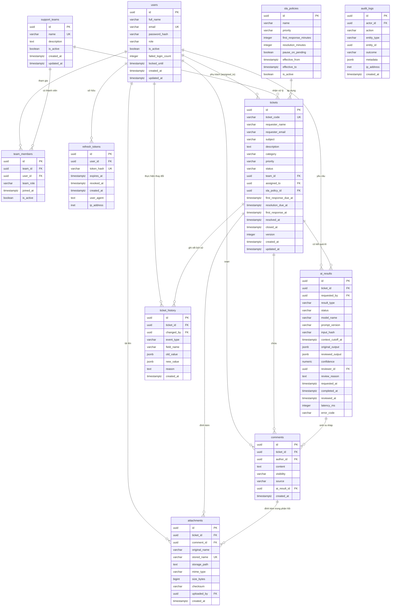

# THIẾT KẾ CƠ SỞ DỮ LIỆU (DATABASE DESIGN)

> **Hệ thống hỗ trợ khách hàng có tích hợp AI (Customer Support System with AI Assistant)**  
> Cơ sở dữ liệu: **PostgreSQL 16+** | ORM: **SQLAlchemy 2.0 (asyncio + asyncpg)** | Migration: **Alembic**  
> Nguồn căn cứ: [`documents/SRS.md`](../documents/SRS.md) — Mục 6 & [`backend/app/models/`](../backend/app/models/)

---

## 1. Sơ đồ thực thể quan hệ (Entity Relationship Diagram - ERD)

---

## 2. Từ điển dữ liệu chi tiết (Data Dictionary)

Hệ thống bao gồm **11 bảng thực thể** được định nghĩa theo chuẩn PostgreSQL và quản lý migration bằng Alembic:

### 2.1 Bảng `users` (Tài khoản người dùng nội bộ)
Lưu trữ tài khoản nhân viên hỗ trợ, quản lý và quản trị viên.

| Tên cột | Kiểu dữ liệu | Ràng buộc | Giá trị mặc định | Mô tả |
|---|---|---|---|---|
| `id` | UUID | PK | `gen_random_uuid()` | Khóa chính định danh tài khoản |
| `full_name` | VARCHAR(100) | NOT NULL | — | Họ và tên đầy đủ |
| `email` | VARCHAR(255) | UNIQUE, NOT NULL | — | Email đăng nhập (chuẩn hóa chữ thường) |
| `password_hash` | VARCHAR(255) | NOT NULL | — | Mật khẩu được băm bằng `bcrypt` |
| `role` | VARCHAR(20) | NOT NULL | — | Vai trò người dùng: `AGENT`, `MANAGER`, `ADMIN` |
| `is_active` | BOOLEAN | NOT NULL | `TRUE` | Trạng thái tài khoản (Hoạt động / Vô hiệu hóa) |
| `failed_login_count` | INTEGER | NOT NULL | `0` | Số lần đăng nhập sai liên tiếp |
| `locked_until` | TIMESTAMPTZ | NULL | `NULL` | Thời điểm mở khóa nếu bị tạm khóa do brute-force |
| `created_at` | TIMESTAMPTZ | NOT NULL | `NOW()` | Thời điểm tạo tài khoản |
| `updated_at` | TIMESTAMPTZ | NOT NULL | `NOW()` | Thời điểm cập nhật thông tin gần nhất |

---

### 2.2 Bảng `support_teams` (Nhóm hỗ trợ)
Lưu trữ các nhóm chuyên môn tiếp nhận vé hỗ trợ (ví dụ: Kỹ thuật, Thanh toán, CSKH).

| Tên cột | Kiểu dữ liệu | Ràng buộc | Giá trị mặc định | Mô tả |
|---|---|---|---|---|
| `id` | UUID | PK | `gen_random_uuid()` | Khóa chính định danh nhóm |
| `name` | VARCHAR(100) | UNIQUE, NOT NULL | — | Tên nhóm hỗ trợ |
| `description` | TEXT | NULL | `NULL` | Mô tả phạm vi phụ trách của nhóm |
| `is_active` | BOOLEAN | NOT NULL | `TRUE` | Trạng thái hoạt động của nhóm |
| `created_at` | TIMESTAMPTZ | NOT NULL | `NOW()` | Thời điểm tạo nhóm |
| `updated_at` | TIMESTAMPTZ | NOT NULL | `NOW()` | Thời điểm cập nhật nhóm gần nhất |

---

### 2.3 Bảng `team_members` (Thành viên nhóm hỗ trợ)
Quản lý mối quan hệ Nhiều - Nhiều giữa người dùng và nhóm, cùng chức vụ trong nhóm.

| Tên cột | Kiểu dữ liệu | Ràng buộc | Giá trị mặc định | Mô tả |
|---|---|---|---|---|
| `id` | UUID | PK | `gen_random_uuid()` | Khóa chính quan hệ |
| `team_id` | UUID | FK `support_teams.id`, NOT NULL | — | Nhóm hỗ trợ |
| `user_id` | UUID | FK `users.id`, NOT NULL | — | Thành viên trong nhóm |
| `team_role` | VARCHAR(20) | NOT NULL | — | Vai trò trong nhóm: `MEMBER` hoặc `MANAGER` |
| `joined_at` | TIMESTAMPTZ | NOT NULL | `NOW()` | Thời điểm tham gia nhóm |
| `is_active` | BOOLEAN | NOT NULL | `TRUE` | Trạng thái thành viên trong nhóm |

* **Chỉ mục Unique**: `uq_team_members_team_user` trên cặp `(team_id, user_id)`.

---

### 2.4 Bảng `tickets` (Phiếu yêu cầu hỗ trợ)
Thực thể trung tâm lưu trữ thông tin vòng đời của vé hỗ trợ khách hàng.

| Tên cột | Kiểu dữ liệu | Ràng buộc | Giá trị mặc định | Mô tả |
|---|---|---|---|---|
| `id` | UUID | PK | `gen_random_uuid()` | Khóa chính định danh nội bộ |
| `ticket_code` | VARCHAR(30) | UNIQUE, NOT NULL | — | Mã vé công khai khó đoán: `TK-XXXXXXXX` |
| `requester_name` | VARCHAR(100) | NOT NULL | — | Họ tên người gửi yêu cầu |
| `requester_email` | VARCHAR(255) | NOT NULL | — | Email người gửi yêu cầu |
| `subject` | VARCHAR(200) | NOT NULL | — | Tiêu đề yêu cầu hỗ trợ |
| `description` | TEXT | NOT NULL | — | Nội dung mô tả ban đầu của khách hàng |
| `category` | VARCHAR(50) | NULL | `NULL` | Phân loại: `TECHNICAL, ACCOUNT, BILLING, GENERAL, OTHER` |
| `priority` | VARCHAR(20) | NOT NULL | `'MEDIUM'` | Mức ưu tiên: `LOW, MEDIUM, HIGH, URGENT` |
| `status` | VARCHAR(20) | NOT NULL | `'OPEN'` | Trạng thái: `OPEN, IN_PROGRESS, PENDING, RESOLVED, CLOSED` |
| `team_id` | UUID | FK `support_teams.id`, NULL | `NULL` | Nhóm hỗ trợ được phân công |
| `assigned_to` | UUID | FK `users.id`, NULL | `NULL` | Nhân viên hỗ trợ trực tiếp phụ trách |
| `sla_policy_id` | UUID | FK `sla_policies.id`, NULL | `NULL` | Chính sách SLA được áp dụng |
| `first_response_due_at` | TIMESTAMPTZ | NULL | `NULL` | Hạn chót phản hồi đầu tiên theo SLA |
| `resolution_due_at` | TIMESTAMPTZ | NULL | `NULL` | Hạn chót giải quyết xong vé theo SLA |
| `first_response_at` | TIMESTAMPTZ | NULL | `NULL` | Thời điểm thực tế nhân viên gửi phản hồi đầu tiên |
| `resolved_at` | TIMESTAMPTZ | NULL | `NULL` | Thời điểm vé được chuyển sang RESOLVED |
| `closed_at` | TIMESTAMPTZ | NULL | `NULL` | Thời điểm vé được chuyển sang CLOSED |
| `version` | INTEGER | NOT NULL | `1` | Số phiên bản dùng cho Khóa lạc quan (Optimistic Lock) |
| `created_at` | TIMESTAMPTZ | NOT NULL | `NOW()` | Thời điểm tạo vé |
| `updated_at` | TIMESTAMPTZ | NOT NULL | `NOW()` | Thời điểm cập nhật vé gần nhất |
| `archived_at` | TIMESTAMPTZ | NULL | `NULL` | Thời điểm lưu trữ vé (nếu có) |

* **Chỉ mục tìm kiếm & lọc**:
  * `ix_tickets_ticket_code` (UNIQUE)
  * `ix_tickets_status_updated` trên `(status, updated_at)`
  * `ix_tickets_team_status` trên `(team_id, status)`
  * `ix_tickets_assigned_status` trên `(assigned_to, status)`
  * `ix_tickets_requester_email` trên `(requester_email)`

---

### 2.5 Bảng `comments` (Bình luận & Ghi chú nội bộ)
Lưu trữ toàn bộ nội dung trao đổi qua lại giữa khách hàng và nhân viên.

| Tên cột | Kiểu dữ liệu | Ràng buộc | Giá trị mặc định | Mô tả |
|---|---|---|---|---|
| `id` | UUID | PK | `gen_random_uuid()` | Khóa chính định danh bình luận |
| `ticket_id` | UUID | FK `tickets.id` (CASCADE), NOT NULL | — | Vé thuộc về |
| `author_id` | UUID | FK `users.id`, NULL | `NULL` | Người gửi (NULL nếu nguồn là khách gửi qua portal sau này) |
| `content` | TEXT | NOT NULL | — | Nội dung bình luận đã được làm sạch |
| `visibility` | VARCHAR(20) | NOT NULL | — | Phạm vi: `PUBLIC` (gửi khách) hoặc `INTERNAL` (nội bộ) |
| `source` | VARCHAR(20) | NOT NULL | `'HUMAN'` | Nguồn tạo: `HUMAN` hoặc `AI_ASSISTED` |
| `ai_result_id` | UUID | FK `ai_results.id`, NULL | `NULL` | Tham chiếu tới bản ghi AI sinh ra nháp (nếu có) |
| `created_at` | TIMESTAMPTZ | NOT NULL | `NOW()` | Thời điểm gửi bình luận |
| `edited_at` | TIMESTAMPTZ | NULL | `NULL` | Thời điểm chỉnh sửa bình luận (nếu có) |
| `deleted_at` | TIMESTAMPTZ | NULL | `NULL` | Thời điểm xóa mềm bình luận (nếu có) |

* **Chỉ mục**: `ix_comments_ticket_created` trên `(ticket_id, created_at)`.

---

### 2.6 Bảng `attachments` (Tệp đính kèm)
Lưu trữ metadata tệp tải lên đi kèm vé hoặc bình luận. Tệp vật lý được lưu trữ ngoài web root bằng UUID.

| Tên cột | Kiểu dữ liệu | Ràng buộc | Giá trị mặc định | Mô tả |
|---|---|---|---|---|
| `id` | UUID | PK | `gen_random_uuid()` | Khóa chính tệp đính kèm |
| `ticket_id` | UUID | FK `tickets.id` (CASCADE), NOT NULL | — | Vé đính kèm |
| `comment_id` | UUID | FK `comments.id`, NULL | `NULL` | Bình luận đính kèm (nếu gửi trong bình luận) |
| `original_name` | VARCHAR(255) | NOT NULL | — | Tên file gốc người dùng tải lên |
| `stored_name` | VARCHAR(255) | UNIQUE, NOT NULL | — | Tên file an toàn lưu trên đĩa (UUID + extension) |
| `storage_path` | TEXT | NOT NULL | — | Đường dẫn lưu trữ nội bộ trên server |
| `mime_type` | VARCHAR(100) | NOT NULL | — | Loại định dạng tệp (đã được kiểm tra an toàn) |
| `size_bytes` | BIGINT | NOT NULL | — | Kích thước file tính bằng byte (≤ 10 MB) |
| `checksum` | VARCHAR(128) | NULL | `NULL` | Mã băm SHA-256 kiểm tra toàn vẹn file |
| `uploaded_by` | UUID | FK `users.id`, NULL | `NULL` | Người dùng tải lên (NULL nếu khách tải qua Portal) |
| `created_at` | TIMESTAMPTZ | NOT NULL | `NOW()` | Thời điểm tải lên |
| `deleted_at` | TIMESTAMPTZ | NULL | `NULL` | Thời điểm xóa tệp (nếu có) |

---

### 2.7 Bảng `ai_results` (Nhật ký & Kết quả Trợ lý AI)
Lưu trữ toàn bộ kết quả phân tích AI và lịch sử kiểm duyệt của con người theo cơ chế **Human-in-the-loop**.

| Tên cột | Kiểu dữ liệu | Ràng buộc | Giá trị mặc định | Mô tả |
|---|---|---|---|---|
| `id` | UUID | PK | `gen_random_uuid()` | Khóa chính định danh kết quả AI |
| `ticket_id` | UUID | FK `tickets.id` (CASCADE), NOT NULL | — | Vé liên quan |
| `requested_by` | UUID | FK `users.id`, NOT NULL | — | Nhân viên bấm yêu cầu AI |
| `result_type` | VARCHAR(30) | NOT NULL | — | Loại tác vụ: `CLASSIFICATION, SUMMARY, DRAFT_REPLY` |
| `status` | VARCHAR(30) | NOT NULL | `'PENDING_REVIEW'` | Trạng thái: `PENDING_REVIEW, APPROVED, EDITED, REJECTED, FAILED` |
| `model_name` | VARCHAR(100) | NOT NULL | — | Tên mô hình AI (ví dụ: `gemini-3.8-flash` hoặc `mock`) |
| `prompt_version` | VARCHAR(30) | NOT NULL | — | Phiên bản prompt hệ thống |
| `input_hash` | VARCHAR(128) | NOT NULL | — | Băm SHA-256 của nội dung đầu vào đã che PII |
| `context_cutoff_at` | TIMESTAMPTZ | NULL | `NULL` | Mốc thời gian của bình luận cuối được đưa vào ngữ cảnh |
| `original_output` | JSONB | NULL | `NULL` | Kết quả gốc có cấu trúc do AI sinh ra |
| `reviewed_output` | JSONB | NULL | `NULL` | Kết quả sau khi con người chỉnh sửa (nếu có) |
| `confidence` | NUMERIC(4,3) | NULL | `NULL` | Độ tin cậy AI tự đánh giá (từ 0.000 đến 1.000) |
| `reviewer_id` | UUID | FK `users.id`, NULL | `NULL` | Nhân viên thực hiện duyệt/từ chối |
| `review_reason` | TEXT | NULL | `NULL` | Ghi chú hoặc lý do chỉnh sửa/từ chối |
| `requested_at` | TIMESTAMPTZ | NOT NULL | `NOW()` | Thời điểm gửi yêu cầu gọi AI |
| `completed_at` | TIMESTAMPTZ | NULL | `NULL` | Thời điểm AI phản hồi hoàn tất |
| `reviewed_at` | TIMESTAMPTZ | NULL | `NULL` | Thời điểm con người duyệt kết quả |
| `latency_ms` | INTEGER | NULL | `NULL` | Thời gian gọi AI tính bằng mili-giây |
| `error_code` | VARCHAR(50) | NULL | `NULL` | Mã lỗi nếu thất bại (`AI_TIMEOUT, AI_RATE_LIMITED, AI_UNAVAILABLE...`) |

* **Chỉ mục**: `ix_ai_results_ticket_type_status_requested` trên `(ticket_id, result_type, status, requested_at)`.

---

### 2.8 Bảng `ticket_history` (Dòng thời gian lịch sử nghiệp vụ vé)
Ghi lại mọi thay đổi thuộc tính quan trọng của vé để phục vụ tra cứu minh bạch.

| Tên cột | Kiểu dữ liệu | Ràng buộc | Giá trị mặc định | Mô tả |
|---|---|---|---|---|
| `id` | UUID | PK | `gen_random_uuid()` | Khóa chính dòng lịch sử |
| `ticket_id` | UUID | FK `tickets.id` (CASCADE), NOT NULL | — | Vé liên quan |
| `changed_by` | UUID | FK `users.id`, NULL | `NULL` | Người thực hiện (NULL nếu là hệ thống) |
| `event_type` | VARCHAR(50) | NOT NULL | — | Loại sự kiện: `STATUS_CHANGED, ASSIGNED, FIELD_UPDATED...` |
| `field_name` | VARCHAR(50) | NULL | `NULL` | Tên trường bị thay đổi (`status, priority, category...`) |
| `old_value` | JSONB | NULL | `NULL` | Giá trị trước khi thay đổi |
| `new_value` | JSONB | NULL | `NULL` | Giá trị sau khi thay đổi |
| `reason` | TEXT | NULL | `NULL` | Lý do thay đổi (ví dụ: lý do mở lại vé) |
| `created_at` | TIMESTAMPTZ | NOT NULL | `NOW()` | Thời điểm ghi nhận thay đổi |

* **Chỉ mục**: `ix_ticket_history_ticket_created` trên `(ticket_id, created_at)`.

---

### 2.9 Bảng `sla_policies` (Chính sách cam kết dịch vụ SLA)
Lưu cấu hình thời hạn phản hồi và giải quyết theo mức độ ưu tiên.

| Tên cột | Kiểu dữ liệu | Ràng buộc | Giá trị mặc định | Mô tả |
|---|---|---|---|---|
| `id` | UUID | PK | `gen_random_uuid()` | Khóa chính chính sách SLA |
| `name` | VARCHAR(100) | NOT NULL | — | Tên chính sách |
| `priority` | VARCHAR(20) | NOT NULL | — | Mức ưu tiên áp dụng: `LOW, MEDIUM, HIGH, URGENT` |
| `first_response_minutes` | INTEGER | NOT NULL | — | Cam kết thời gian phản hồi đầu tiên (phút) |
| `resolution_minutes` | INTEGER | NOT NULL | — | Cam kết thời gian giải quyết xong vé (phút) |
| `pause_on_pending` | BOOLEAN | NOT NULL | `FALSE` | Có tạm dừng hạn khi vé ở trạng thái PENDING không |
| `effective_from` | TIMESTAMPTZ | NOT NULL | — | Thời điểm chính sách bắt đầu có hiệu lực |
| `effective_to` | TIMESTAMPTZ | NULL | `NULL` | Thời điểm kết thúc hiệu lực (NULL = vô thời hạn) |
| `is_active` | BOOLEAN | NOT NULL | `TRUE` | Trạng thái kích hoạt chính sách |

* **Quy tắc kiểm tra**: Chặn xung đột trùng lặp khoảng thời gian `[effective_from, effective_to]` giữa các chính sách cùng `priority` đang active.

---

### 2.10 Bảng `refresh_tokens` (Phiên làm mới JWT)
Quản lý phiên đăng nhập dài hạn của người dùng.

| Tên cột | Kiểu dữ liệu | Ràng buộc | Giá trị mặc định | Mô tả |
|---|---|---|---|---|
| `id` | UUID | PK | `gen_random_uuid()` | Khóa chính phiên |
| `user_id` | UUID | FK `users.id` (CASCADE), NOT NULL | — | Chủ sở hữu phiên |
| `token_hash` | VARCHAR(255) | UNIQUE, NOT NULL | — | Mã băm SHA-256 của Refresh Token |
| `expires_at` | TIMESTAMPTZ | NOT NULL | — | Thời điểm token hết hạn |
| `revoked_at` | TIMESTAMPTZ | NULL | `NULL` | Thời điểm bị thu hồi (khi người dùng đăng xuất) |
| `created_at` | TIMESTAMPTZ | NOT NULL | `NOW()` | Thời điểm tạo phiên |
| `user_agent` | TEXT | NULL | `NULL` | Thông tin trình duyệt và thiết bị |
| `ip_address` | INET | NULL | `NULL` | Địa chỉ IP đăng nhập |

---

### 2.11 Bảng `audit_logs` (Nhật ký kiểm toán hệ thống)
Bảng nhật ký bất biến ghi lại mọi thao tác quan trọng phục vụ quản trị và bảo mật.

| Tên cột | Kiểu dữ liệu | Ràng buộc | Giá trị mặc định | Mô tả |
|---|---|---|---|---|
| `id` | UUID | PK | `gen_random_uuid()` | Khóa chính bản ghi kiểm toán |
| `actor_id` | UUID | FK `users.id`, NULL | `NULL` | Người thực hiện hành động |
| `action` | VARCHAR(100) | NOT NULL | — | Mã hành động: `TICKET_CREATED, TICKET_STATUS_CHANGED, USER_ROLE_UPDATED...` |
| `entity_type` | VARCHAR(50) | NOT NULL | — | Loại đối tượng: `TICKET, USER, TEAM, SLA_POLICY, AI, AUTH` |
| `entity_id` | UUID | NULL | `NULL` | Khóa chính của đối tượng bị tác động |
| `outcome` | VARCHAR(20) | NOT NULL | — | Kết quả thực thi: `SUCCESS` hoặc `FAILURE` |
| `metadata` | JSONB | NULL | `NULL` | Chi tiết bổ sung (không chứa mật khẩu, token hay PII) |
| `ip_address` | INET | NULL | `NULL` | Địa chỉ IP của client |
| `created_at` | TIMESTAMPTZ | NOT NULL | `NOW()` | Thời điểm ghi nhận sự kiện |

* **Chỉ mục**:
  * `ix_audit_logs_created` trên `(created_at)`
  * `ix_audit_logs_actor` trên `(actor_id, created_at)`
  * `ix_audit_logs_entity` trên `(entity_type, entity_id)`

---

## 3. Các quy tắc toàn vẹn & Kỹ thuật cốt lõi

1. **Khóa lạc quan (Optimistic Locking)**:
   * Bảng `tickets` sử dụng cột `version` (kiểu số nguyên tăng dần).
   * Mọi API cập nhật vé (`update_ticket`, `change_status`, `assign_ticket`) bắt buộc phải gửi kèm phiên bản hiện tại mà người dùng đang đọc. Nếu `expected_version != ticket.version`, giao dịch bị rollback và trả về `409 VERSION_CONFLICT`.
2. **Xóa theo tầng (Cascade Deletion)**:
   * Khi một vé bị xóa (hoặc dọn dẹp trong test), các bảng phụ thuộc gồm `comments`, `attachments`, `ai_results`, `ticket_history` được tự động dọn dẹp đồng bộ nhờ ràng buộc `ON DELETE CASCADE`.
3. **Bảo toàn múi giờ (UTC Timezone)**:
   * Mọi trường thời gian đều được định nghĩa kiểu `TIMESTAMPTZ` và lưu trữ theo giờ chuẩn quốc tế `UTC`.
   * Việc chuyển đổi sang múi giờ hiển thị của người dùng (`Asia/Ho_Chi_Minh` UTC+7) được xử lý tại client và trong các truy vấn báo cáo theo ngày.
