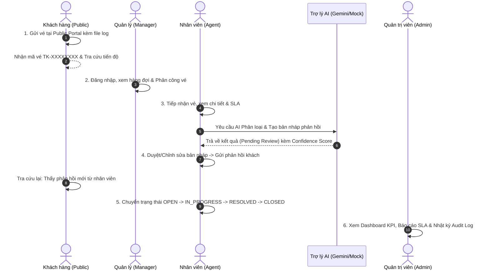

# KỊCH BẢN TRÌNH DIỄN HỆ THỐNG TOÀN TRÌNH (END-TO-END DEMO SCENARIO)

> **Hệ thống hỗ trợ khách hàng có tích hợp AI (Customer Support System with AI Assistant)**  
> **Lát cắt bàn giao:** S7 — Củng cố & Demo (Final Delivery)  
> **Tài liệu tham chiếu:** [`docs/requirements.md`](./requirements.md) & [`docs/superpowers/specs/2026-09-02-ai-customer-support-design.md`](./superpowers/specs/2026-09-02-ai-customer-support-design.md)

---

## 1. Mục đích & Phạm vi kịch bản

Tài liệu này hướng dẫn chi tiết từng bước thực hiện kịch bản trình diễn (Demo) toàn diện hệ thống hỗ trợ khách hàng tích hợp trợ lý AI theo cơ chế **Human-in-the-loop**, xuyên suốt từ khi khách hàng ẩn danh gửi vé tại Cổng công khai, qua các bước phân công, kích hoạt AI phân loại/tạo bản nháp, nhân viên kiểm duyệt, chuyển trạng thái vòng đời theo máy trạng thái, kiểm soát SLA, cho đến báo cáo thống kê Dashboard và giám sát Audit Log của Quản trị viên.

---

## 2. Chuẩn bị môi trường & Dữ liệu mẫu (Prerequisites)

### 2.1 Khởi chạy hệ thống

```bash
# 1. Khởi động toàn bộ stack bằng Docker Compose (PostgreSQL, Backend FastAPI, Frontend Nginx)
docker compose up -d

# 2. Kiểm tra trạng thái sẵn sàng (Health Check)
# Trình duyệt mở: http://localhost:8000/health/ready hoặc http://localhost:5173/health
```

### 2.2 Danh sách tài khoản kiểm thử mẫu (Seed Accounts)

| Vai trò (Role) | Email đăng nhập | Mật khẩu mặc định | Phạm vi quyền hạn (Data Scope) |
|---|---|---|---|
| **Quản trị viên (Admin)** | `admin@example.com` | `Admin@Dev123` | Toàn quyền hệ thống, xem mọi ticket, quản trị user/team/SLA/audit |
| **Quản lý Kỹ thuật (Manager)** | `hung.manager@example.com` | `hung.manager@Dev123` | Quản lý Team Kỹ thuật, phân công vé, xem dashboard nhóm |
| **Nhân viên Kỹ thuật (Agent)** | `lan.agent@example.com` | `lan.agent@Dev123` | Xử lý các vé thuộc Team Kỹ thuật hoặc được gán trực tiếp |
| **Khách hàng (Public User)** | *Không cần tài khoản* | *Không cần mật khẩu* | Thao tác tại Cổng công khai, xác thực bằng Mã vé + Email |

---

## 3. Kịch bản trình diễn chi tiết (6 Bước toàn trình)



---

### Bước 1: Khách hàng gửi yêu cầu hỗ trợ qua Cổng công khai

1. **Truy cập Cổng công khai**:
   - Mở trình duyệt truy cập: `http://localhost:5173/` (hoặc cổng `8080` khi triển khai qua Nginx).
   - Giao diện **Cổng tiếp nhận hỗ trợ khách hàng** xuất hiện với form tiếp nhận trực quan, hỗ trợ chế độ Sáng/Tối.
2. **Điền thông tin sự cố**:
   - **Họ và tên**: `Trần Minh Anh`
   - **Email liên hệ**: `minhanh.demo@gmail.com`
   - **Tiêu đề**: `Lỗi không thể đồng bộ dữ liệu trên ứng dụng di động`
   - **Mô tả chi tiết**: `Từ sáng nay khi tôi mở app phiên bản 2.4 trên Android thì xuất hiện thông báo Lỗi kết nối 504. Đã thử đăng xuất nhưng không thể đồng bộ lại.`
   - **Đính kèm tệp**: Chọn một file ảnh chụp màn hình hoặc file text `error.log` (hệ thống kiểm tra định dạng và kích thước ≤ 10MB).
3. **Bấm "Gửi yêu cầu hỗ trợ"**:
   - Hệ thống phản hồi thành công và cấp **Mã vé công khai** định dạng Base32: Ví dụ `TK-8B3K7Q2M`.
   - SLA được tự động tính toán thời hạn phản hồi đầu tiên và giải quyết theo chính sách mức ưu tiên `MEDIUM`.
4. **Tra cứu tiến độ ngay lập tức**:
   - Nhấp vào nút "Tra cứu tiến độ vé" hoặc truy cập `http://localhost:5173/track`.
   - Nhập đúng `TK-8B3K7Q2M` và email `minhanh.demo@gmail.com`.
   - Kết quả tra cứu hiển thị: Tiêu đề, Trạng thái (`OPEN`), Phân loại, Thời gian gửi và tệp đính kèm.
   - **Bảo mật**: Tuyệt đối không để lộ thông tin nội bộ, ghi chú nhân viên hay audit log (AC-SEC-01, FR-PUB-05).

---

### Bước 2: Quản lý (Manager) tiếp nhận & Phân công vé

1. **Đăng nhập vai trò Quản lý**:
   - Truy cập: `http://localhost:5173/login`.
   - Đăng nhập tài khoản: `hung.manager@example.com` / `hung.manager@Dev123`.
2. **Xem danh sách vé**:
   - Hệ thống chuyển đến trang `/app/tickets`.
   - Quản lý nhìn thấy vé `TK-8B3K7Q2M` đang ở trạng thái `OPEN`, chưa gán người phụ trách (`Chưa gán`).
3. **Thực hiện phân công (Assignment)**:
   - Bấm mở chi tiết vé `TK-8B3K7Q2M`.
   - Tại thanh tác vụ bên phải, bấm **"Phân công"**.
   - Chọn Nhóm: **Team Kỹ thuật**.
   - Chọn Nhân viên: **Trần Thị Lan** (`lan.agent@example.com`).
   - Bấm **"Lưu phân công"**.
   - Hệ thống cập nhật người phụ trách, ghi nhận lịch sử thay đổi và phiên bản khóa lạc quan (`version`).

---

### Bước 3: Nhân viên (Agent) xử lý vé với Trợ lý AI (Human-in-the-Loop)

1. **Đăng nhập vai trò Nhân viên**:
   - Đăng xuất và đăng nhập tài khoản: `lan.agent@example.com` / `lan.agent@Dev123`.
2. **Tiếp nhận vé được gán**:
   - Tại `/app/tickets`, bật bộ lọc **"Chỉ vé tôi phụ trách"** → Vé `TK-8B3K7Q2M` hiển thị ngay đầu danh sách.
   - Bấm mở vé để xem chi tiết, thông tin khách hàng và hạn chót SLA.
3. **Kích hoạt Trợ lý AI — Phân loại vé**:
   - Tại bảng điều khiển **"Trợ lý AI"** ở cột bên phải, bấm **"Phân loại AI"**.
   - Trợ lý AI tự động phân tích tiêu đề và mô tả (đã được làm sạch PII/mã độc).
   - Panel hiển thị kết quả ở trạng thái `PENDING_REVIEW`:
     - Phân loại đề xuất: `TECHNICAL`
     - Mức ưu tiên đề xuất: `HIGH`
     - Độ tin cậy (Confidence Score): `0.95` kèm giải thích logic.
   - **Cơ chế Human-in-the-loop**: Nhân viên bấm **"Chấp nhận (Approve)"** → Mức độ ưu tiên của vé lập tức chuyển sang `HIGH`, SLA được cập nhật lại theo mức mới, hệ thống ghi nhận Audit Log.
4. **Kích hoạt Trợ lý AI — Tạo bản nháp phản hồi (Draft)**:
   - Bấm **"Tạo bản nháp phản hồi"**.
   - AI tạo nội dung thư trả lời khách hàng lịch sự, hướng dẫn các bước khắc phục sự cố kết nối.
   - Nhân viên bấm **"Chỉnh sửa (Edit)"**: Tùy chỉnh thêm câu chào và lưu bản sửa. Hệ thống lưu trữ cả đầu ra gốc của AI và đầu ra sau khi chỉnh sửa (AC-AI-08).
   - Bấm **"Áp dụng vào ô soạn thảo"** → Toàn bộ nội dung bản nháp được chuyển tự động vào khung soạn thảo phản hồi.

---

### Bước 4: Gửi phản hồi khách & Kiểm tra mốc SLA

1. **Gửi bình luận công khai (Public Comment)**:
   - Nhân viên chọn loại bình luận: **Công khai cho khách**.
   - Bấm **"Gửi bình luận"**.
2. **Kiểm tra mốc thời gian SLA**:
   - Ngay khi phản hồi công khai đầu tiên được gửi, hệ thống tự động ghi nhận thời điểm `first_response_at`.
   - Thẻ hiển thị SLA chuyển sang trạng thái hoàn thành phản hồi đúng hạn (`ON_TIME`).
3. **Khách hàng kiểm tra lại trên Cổng công khai**:
   - Mở cửa sổ ẩn danh, truy cập `http://localhost:5173/track`.
   - Nhập mã vé và email → Khách hàng thấy ngay câu trả lời của nhân viên hỗ trợ xuất hiện trên dòng thời gian.
   - Thử thêm một **Ghi chú nội bộ (Internal Note)** từ phía Agent → Khách hàng tra cứu lại xác nhận ghi chú nội bộ không hề xuất hiện.

---

### Bước 5: Chuyển đổi trạng thái theo Máy trạng thái & Đóng vé

1. **Chuyển sang `IN_PROGRESS`**: Nhân viên chuyển trạng thái vé sang Đang xử lý.
2. **Chuyển sang `PENDING` (Chờ khách phản hồi)**:
   - Chuyển trạng thái sang Chờ phản hồi.
   - Hệ thống kích hoạt cơ chế tạm dừng đồng hồ SLA (`pause_on_pending`).
3. **Khách phản hồi & Tiếp tục xử lý**:
   - Nhân viên chuyển vé trở lại `IN_PROGRESS` → Thời hạn SLA tự động được bù thêm đúng khoảng thời gian đã chờ khách (FR-SLA-07).
4. **Giải quyết vé (`RESOLVED`)**:
   - Nhân viên hoàn tất hỗ trợ, chọn chuyển sang **Đã giải quyết (`RESOLVED`)**.
   - Hệ thống ghi nhận mốc `resolved_at`.
5. **Đóng vé (`CLOSED`)**:
   - Vé chuyển sang Đã đóng (`CLOSED`).
6. **Thử nghiệm Reopen (Mở lại vé)**:
   - Khách hàng hoặc Agent có thể mở lại vé đã đóng nếu sự cố tái diễn.
   - Hệ thống yêu cầu bắt buộc nhập lý do mở lại vé. Nếu bỏ trống lý do, hệ thống báo lỗi không cho phép chuyển trạng thái.

---

### Bước 6: Báo cáo thống kê Dashboard & Quản trị hệ thống (Admin)

1. **Đăng nhập Quản trị viên**:
   - Đăng nhập tài khoản: `admin@example.com` / `Admin@Dev123`.
2. **Xem Bảng điều khiển (Dashboard)**:
   - Truy cập `/app/dashboard`.
   - Các thẻ KPI tổng hợp: Tổng số vé, vé đang mở, vé đang xử lý, vé đã giải quyết, tỷ lệ đạt cam kết SLA.
   - Biểu đồ xu hướng (SVG Trend Chart) hiển thị biến động số lượng vé theo ngày/tháng với các mảng màu chuẩn thiết kế.
3. **Khu vực Quản trị hệ thống (Admin Workspace)**:
   - Truy cập `/app/admin`:
     - **Quản lý người dùng (Users)**: Danh sách tài khoản, tạo mới nhân viên, chỉnh sửa vai trò, cơ chế chống vô hiệu hóa quản trị viên cuối cùng (FR-ADM-04).
     - **Quản lý nhóm (Teams)**: Quản lý các nhóm hỗ trợ (Kỹ thuật, CSKH), thêm/xóa thành viên, phân vai trò Manager/Member trong nhóm.
     - **Chính sách SLA (SLA Policies)**: Xem cấu hình hạn mức phản hồi theo độ ưu tiên (URGENT, HIGH, MEDIUM, LOW), cơ chế phát hiện và ngăn chặn khoảng thời gian hiệu lực chồng lấn (`SLA_POLICY_CONFLICT`).
     - **Nhật ký kiểm toán (Audit Logs)**: Bảng nhật ký bất biến ghi lại toàn bộ hành động: tạo vé, phân công, duyệt AI, cập nhật người dùng kèm bộ lọc theo Actor, Action, Entity và trình xem metadata JSON chi tiết.
4. **Kiểm tra giao diện & Chế độ Dark Mode**:
   - Bấm nút **Theme Switcher** (biểu tượng Mặt trời/Mặt trăng) trên thanh điều hướng để chuyển đổi giữa Dark Mode và Light Mode mượt mà.
   - Thu nhỏ cửa sổ về kích thước di động **360px**: Kiểm tra menu thanh bên chuyển thành Drawer trượt, bảng biểu cuộn ngang mượt mà, không vỡ khung hình.

---

## 4. Ma trận nghiệm thu đối chiếu (Traceability Matrix)

| Nhóm tiêu chuẩn | Mã tiêu chí | Mô tả tiêu chí nghiệm thu | Kết quả Demo |
|---|---|---|:---:|
| **Nghiệp vụ cốt lõi** | `AC-01` | Khách gửi vé thành công qua Public Portal, nhận mã `TK-` ngẫu nhiên | **ĐẠT** |
| | `AC-02` | Tra cứu tiến độ vé công khai bằng mã + email chính xác | **ĐẠT** |
| | `AC-03` | Nhân viên xem danh sách, chi tiết, bình luận và đổi trạng thái | **ĐẠT** |
| | `AC-04` | Chuyển trạng thái tuân thủ nghiêm ngặt máy trạng thái State Machine | **ĐẠT** |
| | `AC-05` | Mở lại vé đã giải quyết bắt buộc có lý do | **ĐẠT** |
| | `AC-06` | Khóa lạc quan (`version`) chống ghi đè dữ liệu đồng thời | **ĐẠT** |
| | `AC-07` | Phân công vé theo phạm vi nhóm và kiểm tra nhân viên hoạt động | **ĐẠT** |
| | `AC-08` | Tự động tính hạn SLA và ghi nhận `first_response_at` | **ĐẠT** |
| | `AC-09` | Dashboard thống kê chuẩn xác theo quyền hạn dữ liệu | **ĐẠT** |
| | `AC-10` | Quản trị Admin: User, Team, SLA, Audit Logs bất biến | **ĐẠT** |
| **Trợ lý AI** | `AC-AI-01` | Phân loại danh mục và mức ưu tiên vé tự động | **ĐẠT** |
| | `AC-AI-03` | Tóm tắt trao đổi và tạo bản nháp phản hồi khách | **ĐẠT** |
| | `AC-AI-05` | Cơ chế Human-in-the-loop: Chỉ áp dụng khi nhân viên phê duyệt | **ĐẠT** |
| | `AC-AI-07` | Cảnh báo khi độ tin cậy AI dưới ngưỡng (Low Confidence Warning) | **ĐẠT** |
| | `AC-AI-08` | Lưu trữ đồng thời bản gốc AI và bản chỉnh sửa của nhân viên | **ĐẠT** |
| | `AC-AI-11` | Mọi quyết định AI được ghi nhận vào Audit Log | **ĐẠT** |
| **An toàn bảo mật** | `AC-SEC-01` | Chặn truy cập vé chéo nhóm ngoài phạm vi (IDOR / Scoping) | **ĐẠT** |
| | `AC-SEC-02` | Chặn Agent/Manager gọi API quản trị (RBAC Boundary) | **ĐẠT** |
| | `AC-SEC-03` | Làm sạch mã độc XSS trong form gửi vé và bình luận | **ĐẠT** |
| | `AC-SEC-04` | Chống tấn công SQL Injection bằng tham số hóa ORM | **ĐẠT** |
| | `AC-SEC-05` | Không để lộ mật khẩu, JWT secret, API key hay PII trong log/lỗi | **ĐẠT** |
| | `AC-SEC-06` | Từ chối tệp thực thi (.exe, .sh) và file quá 10MB | **ĐẠT** |
