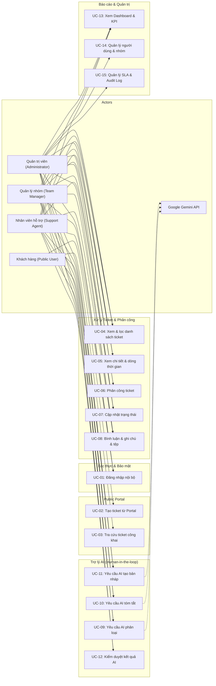

# ĐẶC TẢ USE CASE (USE CASE SPECIFICATIONS)

> **Hệ thống hỗ trợ khách hàng có tích hợp AI (Customer Support System with AI Assistant)**  
> Nguồn căn cứ: [`documents/SRS.md`](../documents/SRS.md) — Mục 5: Đặc tả Use Case

---

## 1. Sơ đồ tổng quan Use Case (Use Case Diagram)

---

## 2. Danh mục chi tiết các Use Case

---

### 2.1 UC-01 – Đăng nhập & Xác thực nội bộ
* **Actor chính**: Support Agent, Team Manager, Administrator.
* **Tiền điều kiện**: Tài khoản người dùng đã được tạo, ở trạng thái hoạt động (`is_active = true`) và không bị khóa.
* **Sự kiện kích hoạt**: Người dùng gửi biểu mẫu đăng nhập tại `/login`.
* **Hậu điều kiện thành công**: Tạo Access Token (JWT 15 phút) và lưu Refresh Token (HttpOnly cookie 7 ngày); điều hướng đến trang mặc định theo vai trò (`/app/admin`, `/app/dashboard`, hoặc `/app/tickets`).
* **Hậu điều kiện thất bại**: Không cấp token, tăng bộ đếm đăng nhập sai (`failed_login_count`). Nếu đạt 5 lần sai liên tiếp, khóa tài khoản trong 15 phút (`locked_until`).

**Luồng sự kiện chính**:
1. Người dùng nhập Email và Mật khẩu trên giao diện đăng nhập.
2. Frontend kiểm tra cơ bản tính hợp lệ của định dạng email và mật khẩu không được rỗng.
3. Backend kiểm tra tài khoản trong database:
   - Xác thực mật khẩu qua thuật toán `bcrypt`.
   - Kiểm tra trạng thái khóa hoặc vô hiệu hóa.
4. Backend đặt lại `failed_login_count = 0`, tạo Access Token và Refresh Token mới.
5. Frontend nhận thông tin người dùng và lưu trạng thái đăng nhập vào Context, điều hướng tới trang phù hợp.

**Ngoại lệ**:
* *Sai email hoặc mật khẩu*: Trả về thông báo lỗi chung `"Email hoặc mật khẩu không chính xác"` (không tiết lộ tài khoản có tồn tại hay không).
* *Tài khoản bị khóa tạm thời*: Trả về lỗi `403 AUTH_ACCOUNT_LOCKED` kèm thời gian hết hạn khóa.
* *Tài khoản bị vô hiệu hóa*: Trả về lỗi `403 AUTH_USER_INACTIVE`.

---

### 2.2 UC-02 – Tạo ticket từ Public Portal
* **Actor chính**: Public User (Khách hàng).
* **Tiền điều kiện**: Public Portal đang hoạt động bình thường.
* **Sự kiện kích hoạt**: Khách hàng điền thông tin và bấm nút "Gửi yêu cầu hỗ trợ" tại `/`.
* **Hậu điều kiện thành công**: Bản ghi ticket mới được tạo ở trạng thái `OPEN`, mức ưu tiên `MEDIUM`, gắn chính sách SLA, lưu tệp đính kèm và hiển thị mã vé `TK-XXXXXXXX` cho khách hàng.

**Luồng sự kiện chính**:
1. Khách hàng nhập: Họ tên, Email, Tiêu đề, Mô tả yêu cầu, Phân loại ban đầu và chọn tệp đính kèm (tối đa 5 tệp, dung lượng mỗi tệp ≤ 10 MB).
2. Frontend kiểm tra tính hợp lệ của dữ liệu đầu vào và định dạng file.
3. Backend kiểm tra giới hạn tần suất (Rate Limit) theo IP khách hàng.
4. Backend sinh mã vé ngẫu nhiên không tuần tự `TK-` + 8 ký tự Base32.
5. Backend xác định chính sách SLA khả dụng cho mức ưu tiên `MEDIUM`, tính toán `resolution_due_at`.
6. Backend lưu thông tin vé và lưu các tệp đính kèm vào thư mục upload ngoài web root, tạo bản ghi `attachments`.
7. Giao diện hiển thị màn hình thông báo thành công kèm mã vé và hướng dẫn tra cứu.

**Ngoại lệ**:
* *Dữ liệu không hợp lệ*: Trả lỗi 422 và chỉ rõ các trường cần chỉnh sửa.
* *Tệp đính kèm vi phạm*: Tệp vượt quá 10 MB, vượt quá 5 tệp hoặc có đuôi file nằm ngoài danh sách cho phép → Hệ thống từ chối toàn bộ yêu cầu, không ghi dữ liệu dở dang.

---

### 2.3 UC-03 – Tra cứu tiến độ ticket công khai
* **Actor chính**: Public User (Khách hàng).
* **Tiền điều kiện**: Ticket đã được tạo trước đó.
* **Sự kiện kích hoạt**: Khách hàng nhập mã vé + email và bấm "Tra cứu" tại `/track`.
* **Hậu điều kiện**: Hiển thị thông tin công khai của vé nếu xác thực chính xác.

**Luồng sự kiện chính**:
1. Khách hàng nhập Mã vé (ví dụ: `TK-ABCD1234`) và Email đã dùng khi tạo vé.
2. Backend kiểm tra rate limit tra cứu.
3. Backend đối chiếu mã vé và email (chuẩn hóa chữ thường không phân biệt hoa thường).
4. Hệ thống chỉ trả về các dữ liệu công khai: Mã vé, tiêu đề, mô tả ban đầu, trạng thái hiện tại, phân loại, ngày tạo, hạn xử lý SLA và danh sách các bình luận có `visibility = 'PUBLIC'`.
5. Frontend hiển thị tiến trình xử lý dưới dạng timeline trực quan.

**Ngoại lệ**:
* *Sai mã vé hoặc sai email*: Hệ thống trả về cùng một thông báo lỗi duy nhất: `"Không tìm thấy vé hỗ trợ phù hợp với thông tin đã nhập"` (ngăn chặn hành vi quét dò mã vé).
* *Không bao giờ để lộ*: Ghi chú nội bộ (`INTERNAL`), thông tin phân công nhân viên, log AI và audit logs.

---

### 2.4 UC-04 – Xem và lọc danh sách ticket (Data Scoping)
* **Actor chính**: Support Agent, Team Manager, Administrator.
* **Tiền điều kiện**: Đã đăng nhập vào hệ thống.
* **Hậu điều kiện**: Hiển thị danh sách vé được phân trang theo đúng phạm vi phân quyền dữ liệu.

**Phạm vi dữ liệu (Data Scoping)**:
* **Support Agent**: Chỉ thấy các vé được gán trực tiếp cho mình HOẶC thuộc các nhóm hỗ trợ mà mình tham gia.
* **Team Manager**: Thấy các vé thuộc các nhóm mình quản lý VÀ các vé chưa được gán vào nhóm nào.
* **Administrator**: Thấy toàn bộ vé trên toàn hệ thống.

**Luồng sự kiện chính**:
1. Người dùng mở trang `/app/tickets`.
2. Backend tự động áp dụng bộ lọc quyền dữ liệu dựa trên vai trò của người dùng.
3. Người dùng có thể kết hợp tìm kiếm từ khóa hoặc lọc theo: Trạng thái, Mức ưu tiên, Nhóm, Phân loại hoặc bật tùy chọn "Chỉ xem vé của tôi".
4. Backend thực hiện truy vấn phân trang phía server (`LIMIT`/`OFFSET`), trả về tổng số bản ghi và danh sách trang hiện tại.
5. Giao diện hiển thị bảng danh sách vé kèm các nhãn trạng thái và thông tin người phụ trách.

---

### 2.5 UC-05 – Xem chi tiết ticket & Dòng thời gian
* **Actor chính**: Support Agent, Team Manager, Administrator.
* **Tiền điều kiện**: Người dùng có quyền truy cập vào ticket tương ứng.
* **Hậu điều kiện**: Hiển thị đầy đủ thông tin chi tiết vé, thanh hành động và dòng thời gian hoạt động.

**Luồng sự kiện chính**:
1. Người dùng bấm vào một vé từ danh sách vé để mở `/app/tickets/:id`.
2. Backend kiểm tra quyền truy cập (Data Scoping). Nếu vé nằm ngoài phạm vi, trả về `404 NOT_FOUND` để bảo mật.
3. Backend nạp thông tin vé, danh sách bình luận (cả PUBLIC và INTERNAL), lịch sử thay đổi trường nghiệp vụ, các tệp đính kèm và các kết quả AI đã sinh ra.
4. Giao diện hiển thị:
   - Cột trái: Tiêu đề, mô tả ban đầu, khung soạn thảo phản hồi, dòng thời gian hoạt động (sắp xếp mới nhất ở trên cùng).
   - Cột phải: Khối thông tin chi tiết vé, khối chuyển trạng thái, khối phân công và khối Trợ lý AI.

---

### 2.6 UC-06 – Phân công ticket (Assignment)
* **Actor chính**: Team Manager, Administrator.
* **Tiền điều kiện**: Ticket đang mở; Actor có quyền phân công.
* **Hậu điều kiện**: Cập nhật nhóm và người phụ trách, ghi nhận lịch sử và Audit Log.

**Luồng sự kiện chính**:
1. Manager/Admin bấm "Phân công người xử lý" trên chi tiết vé.
2. Hệ thống hiển thị hộp thoại chọn Nhóm hỗ trợ và danh sách nhân viên trong nhóm:
   - Manager chỉ thấy các nhóm mình quản lý.
   - Admin thấy tất cả các nhóm đang hoạt động.
3. Người dùng chọn Nhóm, chọn Nhân viên hỗ trợ (chỉ chọn được Agent đang hoạt động trong nhóm) và nhập lý do phân công.
4. Backend kiểm tra tính toàn vẹn và khóa lạc quan (`expected_version`):
   - Đảm bảo nhân viên thuộc nhóm và tài khoản còn hoạt động.
5. Backend cập nhật `team_id`, `assigned_to`, tăng `version` lên 1.
6. Backend ghi một bản ghi vào `ticket_history` (`event_type = 'ASSIGNED'`) và ghi `audit_logs`.

**Ngoại lệ**:
* *Manager gán vé vào nhóm không do mình quản lý*: Bị chặn với lỗi `403 ACCESS_DENIED`.
* *Xung đột phiên bản (Optimistic Lock Conflict)*: Người khác đã chỉnh sửa vé trước đó → Trả lỗi `409 VERSION_CONFLICT`, yêu cầu tải lại trang.

---

### 2.7 UC-07 – Cập nhật trạng thái vé (State Machine)
* **Actor chính**: Support Agent, Team Manager, Administrator.
* **Tiền điều kiện**: Người dùng có quyền trên vé; vé đang ở trạng thái hợp lệ.
* **Hậu điều kiện**: Trạng thái mới được cập nhật, ghi dòng thời gian lịch sử và audit log.

**Bảng chuyển trạng thái hợp lệ (State Machine)**:
* `OPEN` → `IN_PROGRESS`, `PENDING`
* `IN_PROGRESS` → `PENDING`, `RESOLVED`
* `PENDING` → `IN_PROGRESS`
* `RESOLVED` → `CLOSED`, `IN_PROGRESS`
* `CLOSED` → `IN_PROGRESS`

**Luồng sự kiện chính**:
1. Người dùng bấm vào nút chuyển trạng thái tương ứng tại thanh "Chuyển trạng thái vé".
2. Hệ thống hiển thị modal xác nhận chuyển trạng thái và ô nhập lý do thay đổi.
3. Nếu chuyển về `IN_PROGRESS` từ `RESOLVED` hoặc `CLOSED` (Mở lại vé): Lý do là trường bắt buộc.
4. Backend kiểm tra tính hợp lệ theo máy trạng thái và kiểm tra `version`.
5. Nếu chuyển từ `PENDING` sang `IN_PROGRESS`: Nếu SLA có bật `pause_on_pending`, backend tự động tính toán bù thêm khoảng thời gian đã chờ vào deadline giải quyết.
6. Cập nhật trạng thái mới, ghi `ticket_history` và `audit_logs`.

---

### 2.8 UC-08 – Thêm bình luận, ghi chú nội bộ & tệp đính kèm
* **Actor chính**: Support Agent, Team Manager, Administrator.
* **Tiền điều kiện**: Người dùng có quyền truy cập vé.
* **Hậu điều kiện**: Nội dung phản hồi được lưu vào `comments`, tệp đính kèm được lưu vào `attachments`.

**Luồng sự kiện chính**:
1. Người dùng chọn tab: **Phản hồi công khai** (`PUBLIC`) hoặc **Ghi chú nội bộ** (`INTERNAL`).
2. Nhập nội dung văn bản và đính kèm tối đa 5 tệp nếu có.
3. Bấm "Gửi phản hồi khách hàng" hoặc "Lưu ghi chú nội bộ".
4. Backend lưu bình luận. Nếu đây là bình luận công khai đầu tiên của nhân viên, hệ thống tự động cập nhật `first_response_at = NOW()` trên vé để chốt SLA.
5. Giao diện dòng thời gian tự động cập nhật hiển thị bình luận mới ngay lập tức.

---

### 2.9 UC-09 – Yêu cầu AI phân loại vé
* **Actor chính**: Support Agent, Team Manager, Administrator.
* **Actor phụ**: Google Gemini API.
* **Hậu điều kiện**: Tạo một bản ghi `ai_results` ở trạng thái `PENDING_REVIEW` chứa gợi ý danh mục và mức ưu tiên.

**Luồng sự kiện chính**:
1. Người dùng bấm nút "Phân loại tự động" trong khối Trợ lý AI.
2. Backend lấy tiêu đề và nội dung vé, thực hiện che giấu PII (email, số điện thoại).
3. Backend gửi yêu cầu sang Google Gemini API yêu cầu trả về JSON có cấu trúc.
4. Backend kiểm tra tính hợp lệ của JSON trả về, lưu vào bảng `ai_results` với `status = 'PENDING_REVIEW'`, lưu độ tin cậy `confidence` và thời gian phản hồi `latency_ms`.
5. Giao diện hiển thị đề xuất phân loại kèm các nút: "Duyệt đề xuất", "Chỉnh sửa", "Từ chối".

---

### 2.10 UC-10 – Yêu cầu AI tóm tắt lịch sử vé
* **Actor chính**: Support Agent, Team Manager, Administrator.
* **Actor phụ**: Google Gemini API.
* **Hậu điều kiện**: Tạo một bản ghi `ai_results` ở trạng thái `PENDING_REVIEW` chứa bản tóm tắt tiến trình xử lý.

**Luồng sự kiện chính**:
1. Người dùng bấm nút "Tóm tắt AI".
2. Backend thu thập mô tả ban đầu và các bình luận công khai, che giấu PII. Ghi chú nội bộ tuyệt đối không gửi sang AI.
3. Backend gọi Gemini API sinh tóm tắt gồm: Vấn đề chính, các điểm cốt lõi, bước đã xử lý, trạng thái hiện tại và hướng đi tiếp theo.
4. Lưu bản ghi `ai_results` loại `SUMMARY` và hiển thị trên giao diện cho nhân viên tham khảo.

---

### 2.11 UC-11 – Yêu cầu AI tạo bản nháp phản hồi
* **Actor chính**: Support Agent, Team Manager, Administrator.
* **Actor phụ**: Google Gemini API.
* **Hậu điều kiện**: Tạo bản ghi `ai_results` ở trạng thái `PENDING_REVIEW` chứa bức thư gợi ý trả lời khách hàng.

**Luồng sự kiện chính**:
1. Người dùng bấm nút "Nháp trả lời AI".
2. Backend gửi ngữ cảnh cần thiết (sau khi che PII) sang Gemini API để tạo nội dung nháp mang giọng điệu lịch sự, chuyên nghiệp.
3. Backend lưu kết quả vào `ai_results` loại `DRAFT_REPLY`.
4. Người dùng bấm "Đưa vào ô trả lời" để sao chép văn bản vào khung soạn thảo bình luận, tự kiểm tra và chỉnh sửa trước khi chính thức gửi cho khách.

---

### 2.12 UC-12 – Kiểm duyệt kết quả AI (Human-in-the-loop)
* **Actor chính**: Support Agent, Team Manager, Administrator.
* **Tiền điều kiện**: Bản ghi `ai_results` đang ở trạng thái `PENDING_REVIEW`.
* **Hậu điều kiện**: Bản ghi được chuyển sang `APPROVED`, `EDITED`, hoặc `REJECTED`; áp dụng dữ liệu vào vé nếu duyệt.

**Luồng sự kiện**:
* **Duyệt đề xuất (Approve)**:
  1. Người dùng bấm "Duyệt đề xuất".
  2. Backend cập nhật `category` và `priority` vào vé, tăng `version`, ghi `ticket_history` và `audit_logs`.
  3. Cập nhật `ai_results.status = 'APPROVED'`.
* **Chỉnh sửa đề xuất (Edit)**:
  1. Người dùng thay đổi danh mục hoặc mức ưu tiên trong modal chỉnh sửa rồi bấm "Lưu và áp dụng".
  2. Backend lưu kết quả đã sửa vào `reviewed_output`, cập nhật vào vé, đánh dấu `ai_results.status = 'EDITED'`.
* **Từ chối đề xuất (Reject)**:
  1. Người dùng bấm "Từ chối".
  2. Backend đánh dấu `ai_results.status = 'REJECTED'`, không thay đổi bất kỳ trường nào trên vé.

---

### 2.13 UC-13 – Xem Bảng điều khiển & Báo cáo (Dashboard)
* **Actor chính**: Support Agent, Team Manager, Administrator.
* **Tiền điều kiện**: Đã đăng nhập vào hệ thống.
* **Hậu điều kiện**: Hiển thị đầy đủ số liệu KPI, tỷ lệ SLA và biểu đồ xu hướng theo đúng phạm vi phân quyền dữ liệu.

**Luồng sự kiện chính**:
1. Người dùng vào `/app/dashboard`.
2. Chọn khoảng thời gian thống kê: 7 ngày, 30 ngày (mặc định), 90 ngày, 180 ngày, 365 ngày hoặc chọn ngày từ... đến...
3. Backend tự động áp dụng Data Scoping và thực hiện thống kê trực tiếp trong PostgreSQL (theo múi giờ `Asia/Ho_Chi_Minh`):
   - Tổng vé, vé mới, đang xử lý, chờ phản hồi, đã giải quyết/đóng.
   - Thống kê SLA: trong hạn, sắp quá hạn, quá hạn.
   - Thời gian phản hồi đầu tiên và thời gian giải quyết trung bình.
   - Xu hướng vé tạo mới theo từng ngày/tháng có phân tách theo trạng thái.
4. Giao diện hiển thị các thẻ KPI và biểu đồ cột trực quan.

---

### 2.14 UC-14 – Quản trị người dùng và nhóm hỗ trợ
* **Actor chính**: Administrator.
* **Tiền điều kiện**: Đăng nhập bằng tài khoản Quản trị viên (`ADMIN`).
* **Hậu điều kiện**: Dữ liệu người dùng hoặc nhóm hỗ trợ được tạo mới, chỉnh sửa hoặc thay đổi trạng thái, đồng thời ghi nhận audit log.

**Luồng sự kiện chính**:
1. Admin truy cập `/app/admin/users` hoặc `/app/admin/teams`.
2. **Quản trị người dùng**:
   - Tạo mới nhân viên, đặt mật khẩu ban đầu, phân vai trò (`AGENT, MANAGER, ADMIN`).
   - Sửa thông tin, kích hoạt hoặc vô hiệu hóa tài khoản.
   - Hệ thống tự động chặn hành vi vô hiệu hóa Admin cuối cùng.
3. **Quản trị nhóm hỗ trợ**:
   - Tạo nhóm hỗ trợ mới (ví dụ: Team Kỹ thuật, Team Thanh toán).
   - Thêm thành viên vào nhóm và chỉ định vai trò trong nhóm (`MEMBER` hoặc `MANAGER`).
   - Chặn thêm tài khoản đang bị vô hiệu hóa vào nhóm.

---

### 2.15 UC-15 – Quản lý chính sách SLA & Xem nhật ký kiểm toán
* **Actor chính**: Administrator.
* **Tiền điều kiện**: Đăng nhập bằng tài khoản Quản trị viên (`ADMIN`).
* **Hậu điều kiện**: Chính sách SLA được lưu trữ hoặc nhật ký kiểm toán được truy vấn.

**Luồng sự kiện chính**:
1. Admin truy cập `/app/admin/sla-policies` hoặc `/app/admin/audit-logs`.
2. **Quản lý SLA**:
   - Cấu hình cam kết thời gian phản hồi đầu tiên và thời gian giải quyết theo 4 mức ưu tiên: `LOW, MEDIUM, HIGH, URGENT`.
   - Bật/tắt tính năng tạm dừng SLA khi chờ khách hàng (`pause_on_pending`).
   - Hệ thống tự động kiểm tra và chặn xung đột trùng lặp khoảng thời gian hiệu lực giữa các chính sách cùng mức ưu tiên.
3. **Tra cứu Nhật ký kiểm toán (Audit Logs)**:
   - Lọc theo loại đối tượng: `USER, TEAM, SLA_POLICY, TICKET, AI, AUTH`.
   - Lọc theo hành động, khoảng ngày.
   - Bấm xem chi tiết metadata JSON bất biến của từng sự kiện để phục vụ thanh tra và kiểm soát tuân thủ.
